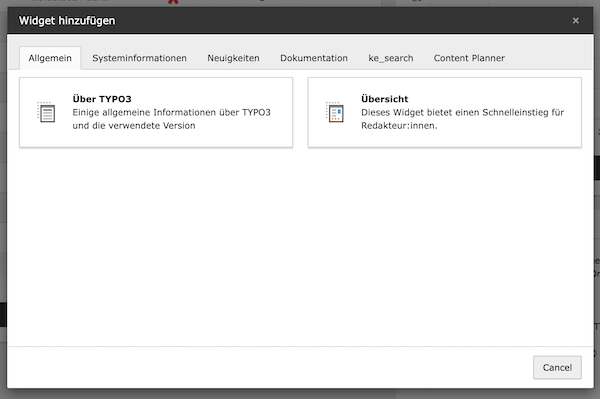
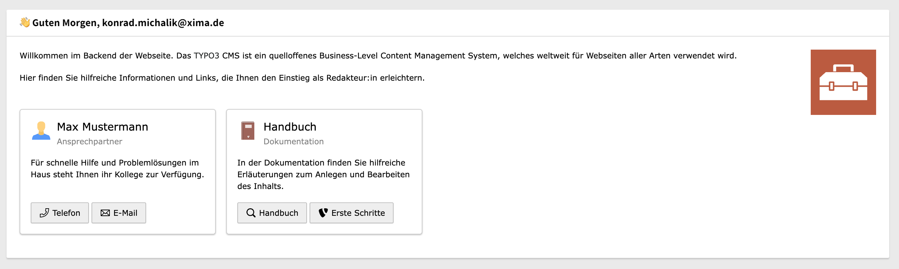

<div align="center">


# TYPO3 extension `xima_typo3_toolbox`

[]()

</div>

This extension provides several tools for TYPO3 integrators and developers.

__Features__:
- Backend toolbar item for project version and application context
- Frontend hint for technical context information
- Last updated information within system information toolbar
- Application context endpoint
- Technical headline content element for e.g. styleguides or technical documentation
- Integration of axe accessibility testing engine
- Various collection of TYPO3 ViewHelpers

## Installation

``` bash
composer require xima/xima-typo3-toolbox
```

## Configuration

Include the static TypoScript template "TYPO3 Toolbox" or directly import it in your sitepackage:

``` typoscript
@import 'EXT:xima_typo3_toolbox/Configuration/TypoScript/setup.typoscript'
```

See `ext_localconf.php` for additional configuration options.

E.g. disabling the toolbar-item feature:

``` php
$GLOBALS['TYPO3_CONF_VARS']['EXTENSIONS'][Configuration::EXT_KEY]['toolbarItem']['enable'] = false;
```

## Features

### Backend toolbar

The *backend toolbar* will show the current project version and application context.


### Frontend hint

The *frontend hint* will show the current technical context information within dedicated contexts.


### Last updated information

You can find the *last update* information within the system information toolbar.


### Application context endpoint

The *application context endpoint*, e.g. for production/standby environments, is available at `index.php?eID=1719931549`.

> Hint: change the eID key in `ext_localconf.php` if needed.

```json
[
  "Development"
]
```

### Technical headline

The *technical headline* is a content element to structure e.g. your styleguide or content element overview (not for production frontend usage). It automatically generates a table of contents based on the headlines.


### Dashboard widget

#### Overview

The extension comes with a prepared overview dashboard widget as a starting point for editors. Simply configure this widget in your `Services.yaml` to your needs. Example configuration below:

```yaml
services:
    Xima\XimaTypo3Toolbox\Widgets\Overview:
    class: 'Xima\XimaTypo3Toolbox\Widgets\Overview'
    arguments:
        $options:
            description: '<p>Willkommen im Backend der Webseite. Das <a href="https://typo3.org/cms" target="_blank">TYPO3</a> CMS ist ein quelloffenes Business-Level Content Management System, welches weltweit für
                Webseiten aller Arten verwendet wird.</p><p>Hier finden Sie hilfreiche Informationen und Links, die Ihnen den Einstieg als Redakteur:in erleichtern.</p>'
            logo:
                path: 'EXT:xima_typo3_toolbox/Resources/Public/Icons/Extension.svg'
                alt: 'Default logo'
                width: 100
            cards:
                - title: 'Max Mustermann'
                  subtitle: 'Ansprechpartner'
                  description: 'Für schnelle Hilfe und Problemlösungen im Haus steht Ihnen ihr Kollege zur Verfügung.'
                  icon: 'install-reset-user'
                  links:
                      - url: 'tel:+4935123456789'
                        label: 'Telefon'
                        icon: 'actions-phone'
                      - url: 'mailto:todo@de.de'
                        label: 'E-Mail'
                        icon: 'actions-envelope'
                - title: 'Handbuch'
                  subtitle: 'Dokumentation'
                  description: 'In der Dokumentation finden Sie hilfreiche Erläuterungen zum Anlegen und Bearbeiten des Inhalts.'
                  icon: 'install-documentation'
                  links:
                      - module: 'help_manual'
                        target: '_blank'
                        label: 'Handbuch'
                        icon: 'actions-search'
                      - url: 'https://docs.typo3.org/m/typo3/tutorial-getting-started/main/en-us/Index.html'
                        target: '_blank'
                        label: 'Erste Schritte'
                        icon: 'actions-brand-typo3'
        tags:
            -   name: dashboard.widget
                identifier: 'toolboxOverview'
                groupNames: 'general'
                title: 'LLL:EXT:xima_typo3_toolbox/Resources/Private/Language/locallang_be.xlf:widgets.overview.title'
                description: 'LLL:EXT:xima_typo3_toolbox/Resources/Private/Language/locallang_be.xlf:widgets.overview.description'
                iconIdentifier: 'content-widget-overview'
                height: 'medium'
                width: 'medium'
```

Add the widget to your dashboard in the TYPO3 backend.




> Hint: Optionally add a default dashboard preset to show the overview widget to all editors.

Provide a configuration for the default dashboard preset in your `Configuration/Backend/DashboardPresets.php`:
```php
<?php

return [
    'default' => [
        'title' => 'LLL:EXT:your_extension/Resources/Private/Language/locallang.xlf:dashboard.default',
        'description' => 'LLL:EXT:your_extension/Resources/Private/Language/locallang.xlf:dashboard.default.description',
        'iconIdentifier' => 'content-dashboard',
        'defaultWidgets' => ['toolboxOverview', 't3information'],
        'showInWizard' => false,
    ],
];

```

### Axe

[Axe](https://www.deque.com/axe/) is an accessibility testing engine for websites. It will be automatically (regarding the configured application context) integrated into the TYPO3 frontend and display accessibility issues of your website within the browser console.


### ViewHelpers

See the [ViewHelpers documentation](./Documentation/ViewHelpers/CLASSES.md) for a complete list of available ViewHelpers.

## Development

Use the following composer script to update the ViewHelper documentation:

``` bash
composer doc:viewhelpers
```

## License

This project is licensed
under [GNU General Public License 2.0 (or later)](LICENSE.md).
