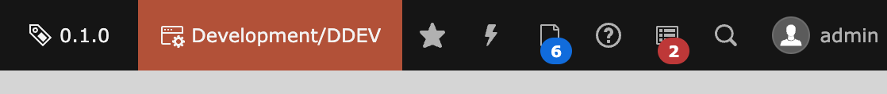
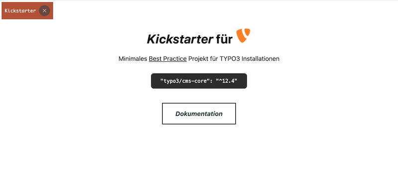
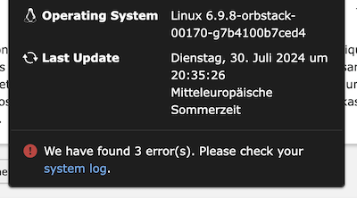
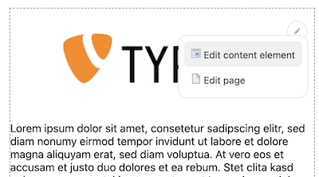
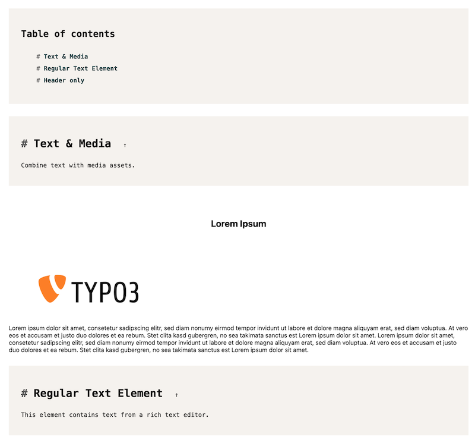

<div align="center">


# TYPO3 extension `xima_typo3_toolbox`

[]()

</div>

This extension provides several tools for TYPO3 integrators and developers.

__Features__:
- Backend toolbar item for project version and application context
- Frontend hint for technical context information
- Last updated information within system information toolbar
- Application context endpoint
- Frontend editing link within content elements for editors
- Technical headline content element for e.g. styleguides or technical documentation
- Integration of axe accessibility testing engine
- Various collection of TYPO3 ViewHelpers

## Installation

``` bash
composer require xima/xima-typo3-toolbox
```

## Configuration

Include the static TypoScript template "TYPO3 Toolbox" or directly import it in your sitepackage:

``` typoscript
@import 'EXT:xima_typo3_toolbox/Configuration/TypoScript/setup.typoscript'
```

See `ext_localconf.php` for additional configuration options.

E.g. enabling the feature toggle for frontend editing:

``` php
$GLOBALS['TYPO3_CONF_VARS']['EXTENSIONS']['xima_typo3_toolbox']['frontendEditing']['enable'] = true;
```

## Features

### Backend toolbar

The *backend toolbar* will show the current project version and application context.



### Frontend hint

The *frontend hint* will show the current technical context information within dedicated contexts.



### Last updated information

You can find the *last update* information within the system information toolbar.



### Application context endpoint

The *application context endpoint*, e.g. for production/standby environments, is available at `index.php?eID=1719931549`.

> Hint: change the eID key in `ext_localconf.php` if needed.

```json
[
  "Development"
]
```

### Frontend editing

The *"frontend editing"* shows links (for logged-in users) in the frontend to easily edit content elements.



The logic behind is very simple. A javascript is injected into the frontend, which consider all dom elements with a c-id, e.g. "c908", because it assumes that this will be a TYPO3 content element with the corresponding uid. The script will then generate a link to the TYPO3 backend with the according edit view.

> Hint: The script is only injected if the feature toggle is enabled and the current backend user is logged in.


### Technical headline

The *technical headline* is a content element to structure e.g. your styleguide or content element overview (not for production frontend usage). It automatically generates a table of contents based on the headlines.



### Axe

[Axe](https://www.deque.com/axe/) is an accessibility testing engine for websites. It will be automatically (regarding the configured application context) integrated into the TYPO3 frontend and display accessibility issues of your website within the browser console.


### ViewHelpers

See the [ViewHelpers documentation](./Documentation/ViewHelpers/CLASSES.md) for a complete list of available ViewHelpers.

## Development

Use the following composer script to update the ViewHelper documentation:

``` bash
composer doc:viewhelpers
```

## License

This project is licensed
under [GNU General Public License 2.0 (or later)](LICENSE.md).
