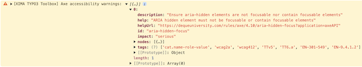

<div align="center">


# TYPO3 extension `xima_typo3_toolbox`

[]()

</div>

This extension provides several tools for TYPO3 integrators and developers.

__Features__:
- Backend toolbar item for project version and application context
- Frontend hint for technical context information
- Last updated information within system information toolbar
- Application context endpoint
- Technical headline content element for e.g. styleguides or technical documentation
- Integration of axe accessibility testing engine
- Various collection of TYPO3 ViewHelpers

## Installation

``` bash
composer require xima/xima-typo3-toolbox
```

## Configuration

Include the static TypoScript template "TYPO3 Toolbox" or directly import it in your sitepackage:

``` typoscript
@import 'EXT:xima_typo3_toolbox/Configuration/TypoScript/setup.typoscript'
```

See `ext_localconf.php` for additional configuration options.

E.g. disabling the toolbar-item feature:

``` php
$GLOBALS['TYPO3_CONF_VARS']['EXTENSIONS'][Configuration::EXT_KEY]['toolbarItem']['enable'] = false;
```

## Features

### Backend toolbar

The *backend toolbar* will show the current project version and application context.


### Frontend hint

The *frontend hint* will show the current technical context information within dedicated contexts.


### Last updated information

You can find the *last update* information within the system information toolbar.


### Application context endpoint

The *application context endpoint*, e.g. for production/standby environments, is available at `index.php?eID=1719931549`.

> Hint: change the eID key in `ext_localconf.php` if needed.

```json
[
  "Development"
]
```

### Technical headline

The *technical headline* is a content element to structure e.g. your styleguide or content element overview (not for production frontend usage). It automatically generates a table of contents based on the headlines.


### Axe

[Axe](https://www.deque.com/axe/) is an accessibility testing engine for websites. It will be automatically (regarding the configured application context) integrated into the TYPO3 frontend and display accessibility issues of your website within the browser console.



### ViewHelpers

See the [ViewHelpers documentation](./Documentation/ViewHelpers/CLASSES.md) for a complete list of available ViewHelpers.

## Development

Use the following composer script to update the ViewHelper documentation:

``` bash
composer doc:viewhelpers
```

## License

This project is licensed
under [GNU General Public License 2.0 (or later)](LICENSE.md).
